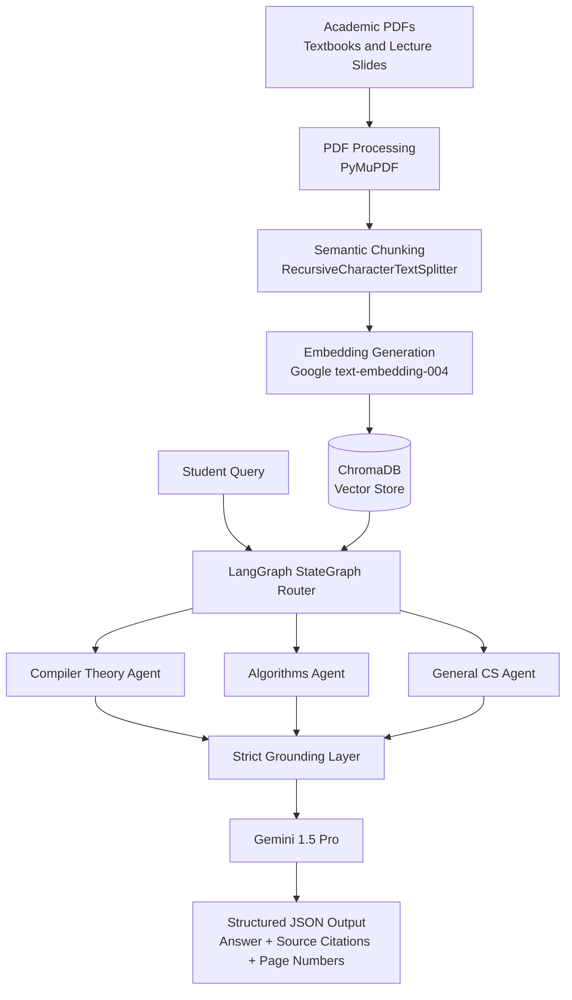

# Polymath.ai
Polymath.ai is a hyper-specialized EdTech RAG engine built for technical document synthesis. Powered by a LangGraph multi-agent architecture, Gemini, FastAPI, and Next.js, it converts complex academic materials into grounded, citation-backed knowledge bases with automated assessment and step-by-step grading rubrics.

> **A citation-backed, multi-agent Generative AI tutor for rigorous computer science education.**


---

## Project Description

**Polymath.ai** is a hyper-specialized, multi-agent educational RAG (Retrieval-Augmented Generation) engine designed for demanding computer science domains such as compiler theory, algorithms, systems, and other technically rigorous coursework.

The project addresses a central weakness of general-purpose AI tutors: **unverified explanations that can sound convincing while being unsupported by course material**. Polymath.ai instead grounds every answer in retrieved academic context from textbooks, lecture slides, and technical PDFs. Its agents are instructed to reason only over retrieved chunks, produce structured citation metadata, and decline to answer when evidence is insufficient.

From an academic perspective, Polymath.ai demonstrates how modern Generative AI systems can be engineered for **trustworthy educational support** rather than generic content generation. It combines document ingestion, vector search, multi-agent routing, and strict output guardrails into a robust architecture intended to reduce hallucinations and improve explainability in AI-assisted learning.

---

## Architecture Diagram



---

## Tech Stack

| Layer | Technologies | Purpose |
|---|---|---|
| Backend Core | Python, LangChain, LangGraph | RAG orchestration, agent routing, state management |
| LLM & Embeddings | Google Gemini 1.5 Pro, `models/text-embedding-004` | Grounded answer generation and semantic vectorization |
| Vector Database | ChromaDB | Persistent vector indexing and similarity retrieval |
| Document Processing | PyMuPDF, RecursiveCharacterTextSplitter | PDF extraction, chunking, and metadata preservation |
| Web/API Layer | FastAPI, Next.js, Tailwind CSS | Upcoming API and user-facing learning interface |
| Configuration | `.env`, environment variables | Secure API key and runtime configuration management |

---

## Key Features

- **Multi-Agent LangGraph StateGraph**
  Classifies incoming student queries and routes them to specialized domain agents, allowing the system to provide focused explanations for distinct computer science topics.

- **Strict Grounding and Hallucination Guardrails**
  Agents rely entirely on retrieved vector chunks. If the available context is incomplete or irrelevant, the system refuses to fabricate an answer and instead returns a structured insufficiency response.

- **Slide-Level and Page-Level Citations**
  Responses include source document names, page numbers, and retrieved chunk references so learners can verify answers directly against course material.

- **Robust Academic PDF Ingestion**
  Handles complex textbooks and lecture slides using PyMuPDF extraction, semantic chunking, metadata tracking, and ChromaDB indexing.

- **Structured JSON Responses**
  Outputs are designed for downstream API consumption, enabling integration with future FastAPI endpoints, dashboards, and Next.js learning workflows.

- **Educationally Focused RAG Design**
  Prioritizes correctness, traceability, and explainability over open-ended generation, making the system suitable for high-stakes academic contexts.

---

## Getting Started / Local Setup

### Prerequisites

Ensure the following tools are installed before running Polymath.ai locally:

| Requirement | Recommended Version | Notes |
|---|---:|---|
| Python | 3.10+ | Required for ingestion, RAG, and agent orchestration |
| Node.js | 18+ | Required for the upcoming Next.js frontend |
| Git | Latest stable | Required for cloning and version control |
| Google API Key | Gemini-enabled | Required for Gemini and embedding model access |

### Installation

1. **Clone the repository**

   ```bash
   git clone https://github.com/<your-username>/Polymath.ai.git
   cd Polymath.ai
   ```

2. **Create and activate a Python virtual environment**

   ```bash
   python -m venv .venv
   source .venv/bin/activate
   ```

   On Windows PowerShell:

   ```powershell
   python -m venv .venv
   .venv\Scripts\Activate.ps1
   ```

3. **Install Python dependencies**

   ```bash
   pip install -r requirements.txt
   ```

4. **Install frontend dependencies when the web layer is available**

   ```bash
   cd frontend
   npm install
   ```

5. **Create a local environment file**

   ```bash
   cp .env.example .env
   ```

6. **Add your Google API key**

   Open `.env` and set `GOOGLE_API_KEY` to a valid Gemini-enabled API key.

---

## Environment Variables

Create a `.env.example` file using the structure below:

```env
# Google Gemini / Embeddings
GOOGLE_API_KEY=your_google_api_key_here
GEMINI_MODEL=gemini-1.5-pro
EMBEDDING_MODEL=models/text-embedding-004

# Vector Database
CHROMA_DB_DIR=./chroma_db
COLLECTION_NAME=polymath_cs_corpus

# Document Ingestion
DOCUMENTS_DIR=./data/documents
CHUNK_SIZE=1200
CHUNK_OVERLAP=200

# API Configuration - upcoming FastAPI layer
API_HOST=0.0.0.0
API_PORT=8000

# Frontend Configuration - upcoming Next.js layer
NEXT_PUBLIC_API_BASE_URL=http://localhost:8000
```

---

## Usage / Quick Start

> The exact script names may vary as the project evolves. The commands below show the intended local workflow for ingestion and query testing.

### 1. Add academic source documents

Place textbooks, lecture slides, or technical PDFs in the configured documents directory:

```bash
mkdir -p data/documents
cp /path/to/lecture-slides.pdf data/documents/
```

### 2. Run the ingestion pipeline

```bash
python scripts/ingest.py --input data/documents --persist-dir chroma_db
```

This extracts PDF text, chunks the material, generates embeddings with `models/text-embedding-004`, and stores indexed vectors in ChromaDB.

### 3. Test a grounded query

```bash
python scripts/query.py "Explain FIRST and FOLLOW sets in compiler design."
```

The LangGraph router classifies the query, selects the appropriate domain agent, retrieves relevant chunks, and returns a structured answer with citations.

---

## Example Output

```json
{
  "status": "success",
  "query": "Explain FIRST and FOLLOW sets in compiler design.",
  "domain": "compiler_theory",
  "answer": {
    "summary": "FIRST and FOLLOW sets are grammar-analysis constructs used during parser construction. FIRST identifies the terminals that can begin strings derived from a grammar symbol, while FOLLOW identifies the terminals that can appear immediately to the right of a nonterminal in a sentential form.",
    "steps": [
      "Compute FIRST sets for terminals directly and for nonterminals by examining their productions.",
      "Propagate epsilon where a production can derive the empty string.",
      "Compute FOLLOW sets by scanning production bodies and adding lookahead terminals or inherited FOLLOW symbols where appropriate."
    ],
    "confidence": "high"
  },
  "citations": [
    {
      "source_document": "compiler-design-lecture-04.pdf",
      "page_number": 12,
      "chunk_id": "compiler-design-lecture-04_p12_c03"
    },
    {
      "source_document": "compiler-design-lecture-05.pdf",
      "page_number": 7,
      "chunk_id": "compiler-design-lecture-05_p07_c01"
    }
  ],
  "guardrails": {
    "grounded_in_retrieval": true,
    "hallucination_policy": "answer_only_from_retrieved_context",
    "insufficient_context": false
  }
}
```

If retrieved context is insufficient, Polymath.ai is designed to return a refusal-style response rather than inventing unsupported information.

---

## Roadmap

| Phase | Status | Scope |
|---|---|---|
| Phase 1 | Complete | PDF ingestion, text extraction, semantic chunking, metadata preservation, ChromaDB indexing |
| Phase 2 | Complete | RAG retrieval, LangGraph multi-agent routing, grounded response generation, structured JSON citations |
| Phase 3 | In active development | FastAPI service layer, Next.js frontend, Tailwind CSS interface, interactive tutor workflows |
| Phase 4 | Planned | Evaluation harness, retrieval quality metrics, automated regression tests, expanded domain agents |

---

## Academic Positioning

Polymath.ai is designed as a final-year Generative AI engineering project that emphasizes **system reliability, source attribution, and controlled generation**. Rather than treating an LLM as a standalone answer engine, the project frames the model as one component in a larger educational architecture where retrieval, routing, citations, and guardrails work together to support trustworthy learning.

---

## License

This project is intended to be released under the MIT License. Update this section if a different license is selected.
